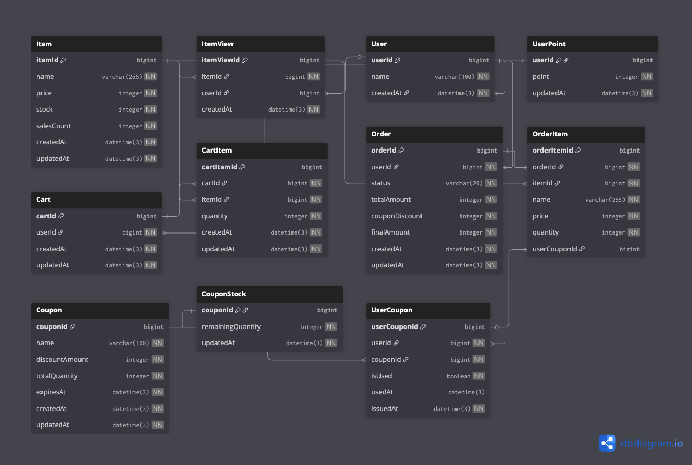
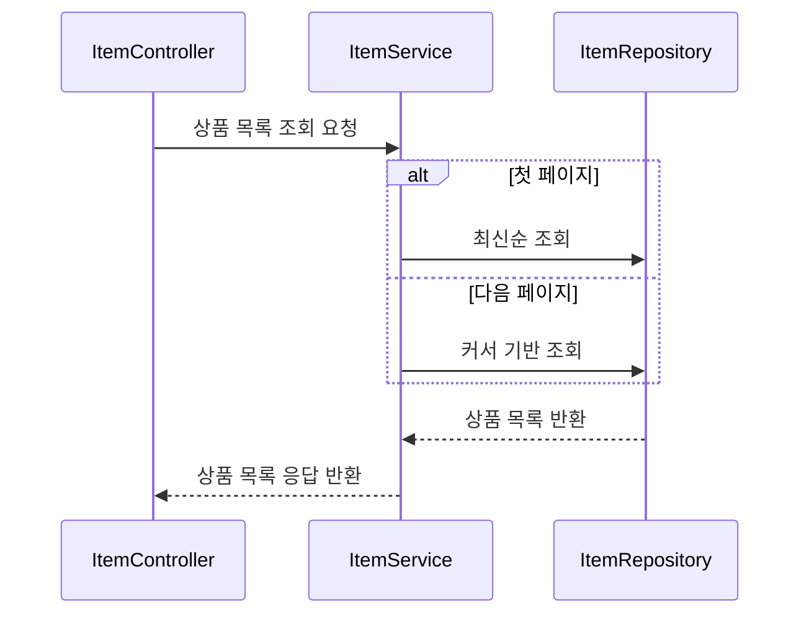
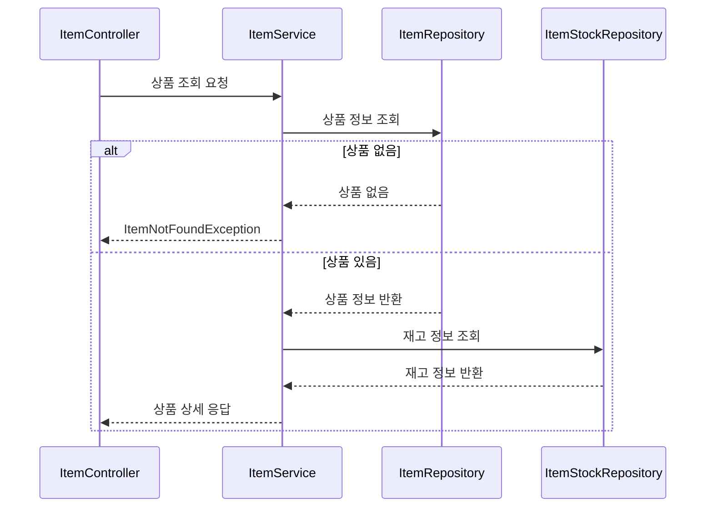
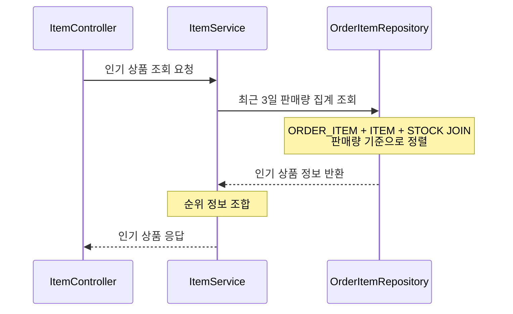
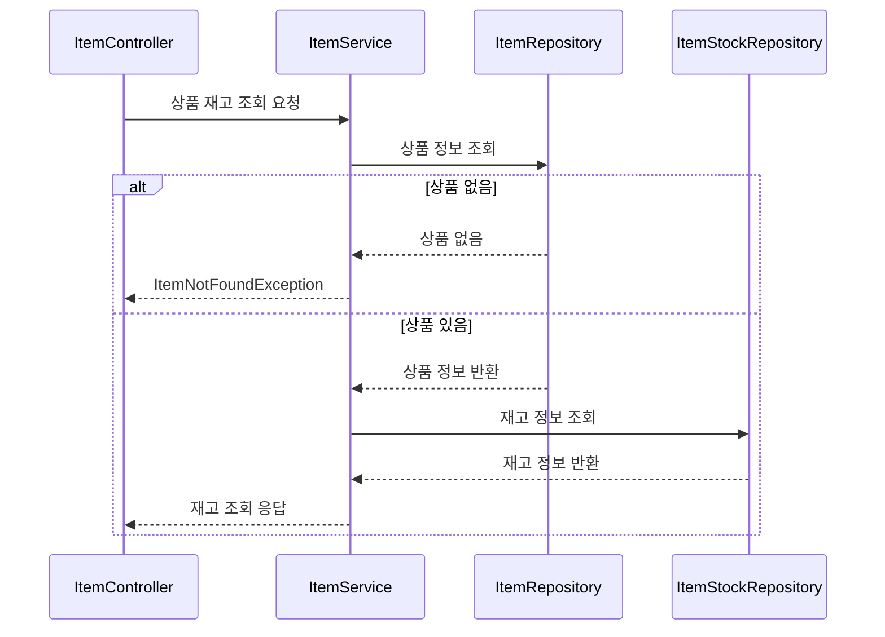
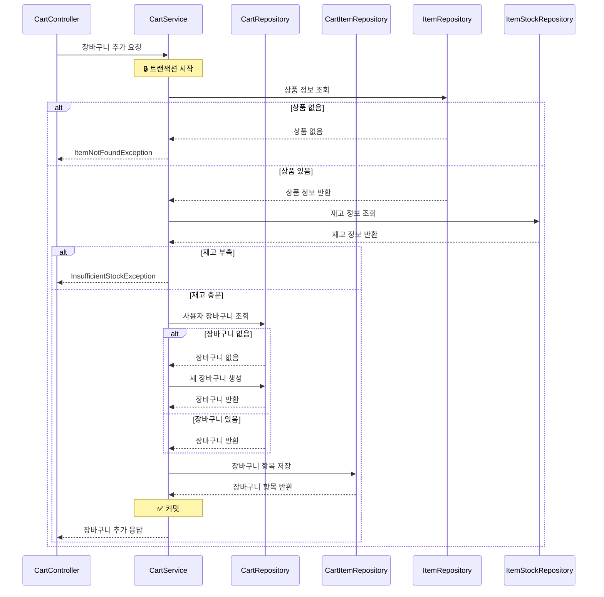
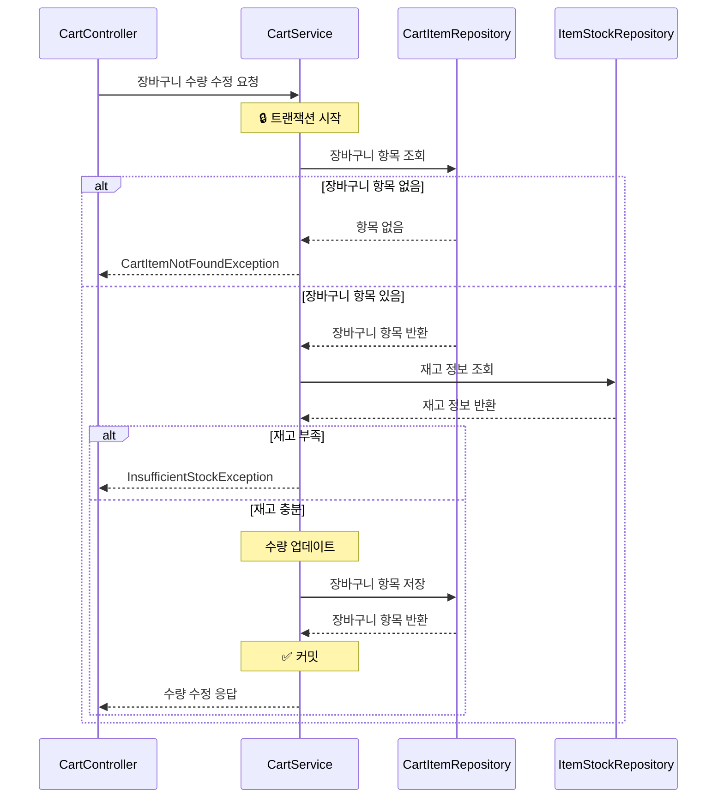
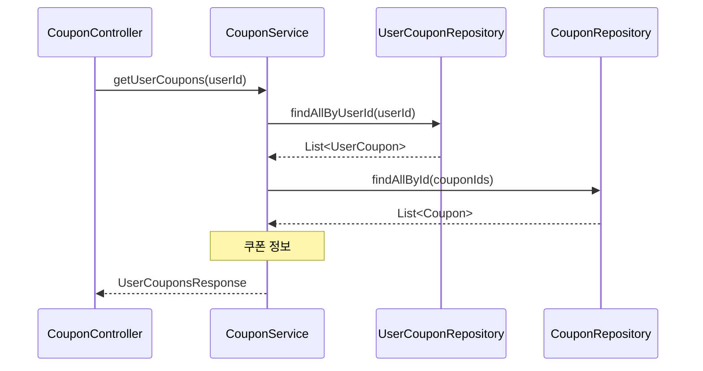
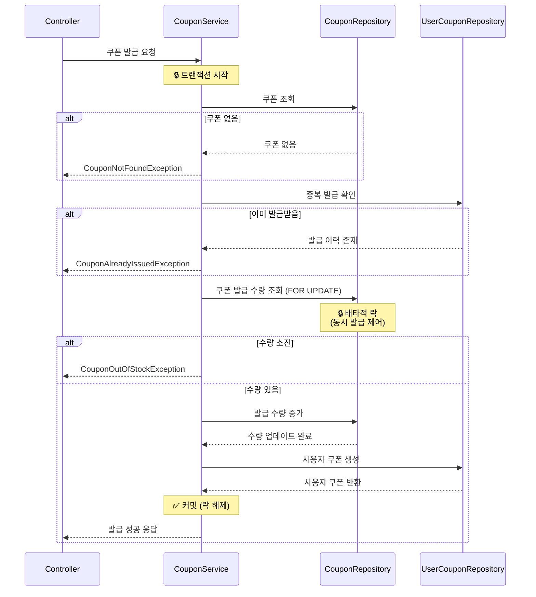
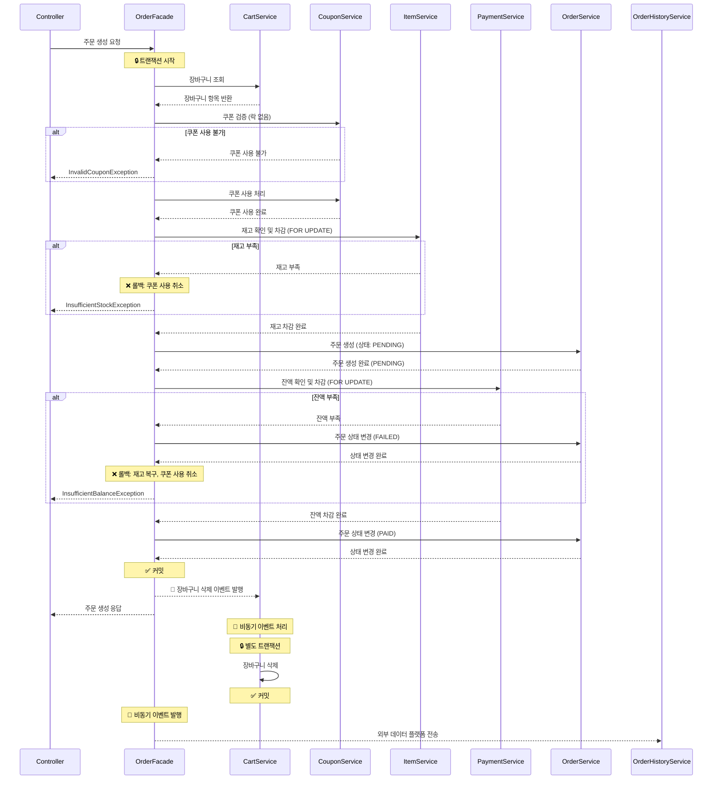

# E-Commerce 시스템

## ERD (Entity Relationship Diagram)

---

## API 시퀀스 다이어그램

### 1.1 상품 목록 조회 (GET /api/items) - Cursor 기반 페이징

### 1.2 상품 상세 조회 (GET /api/items/{itemId})

### 1.3 인기 상품 조회 (GET /api/items/popular)

초기에는 MySQL 사용하여 쿼리로만 처리, 후에 별도의 집계 테이블을 두거나 캐싱 사용 고려.

### 1.4 상품 재고 확인 (GET /api/items/{itemId}/stock)

### 2.1 장바구니 상품 추가 (POST /api/cart/items)

### 2.3 장바구니 수량 수정 (PATCH/api/cart/items/{cartItemId})

### 3.1 사용자 쿠폰 조회 (GET /api/users/{userId}/coupons)

### 3.2 쿠폰 발급 (POST /api/coupons/{couponId}/issue)

### 4.1 주문 생성 (POST /api/orders)

