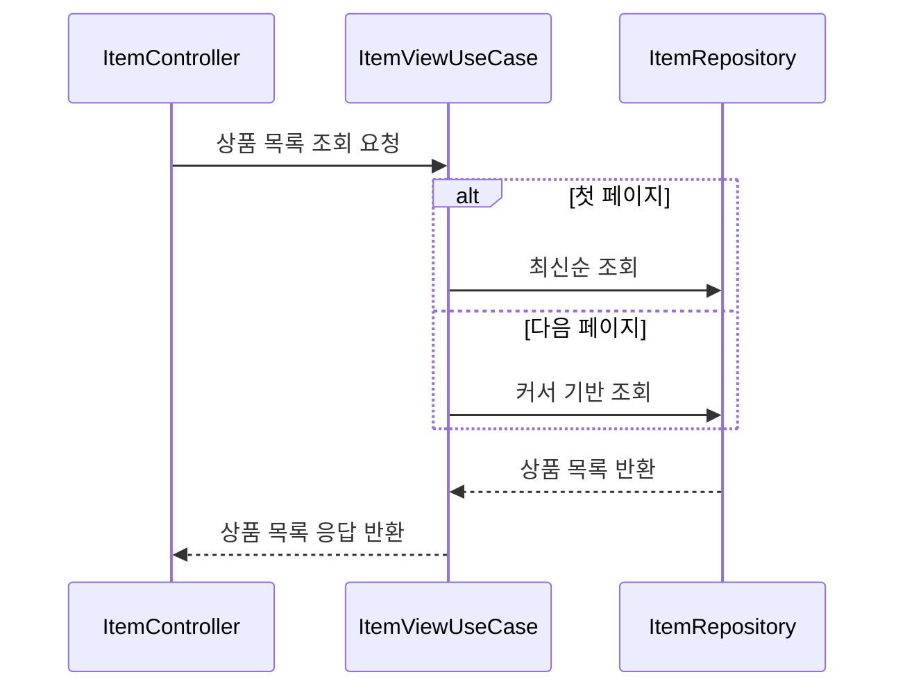
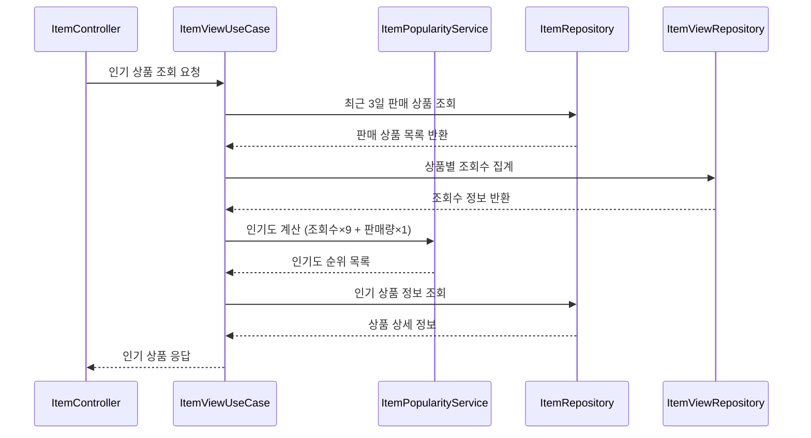
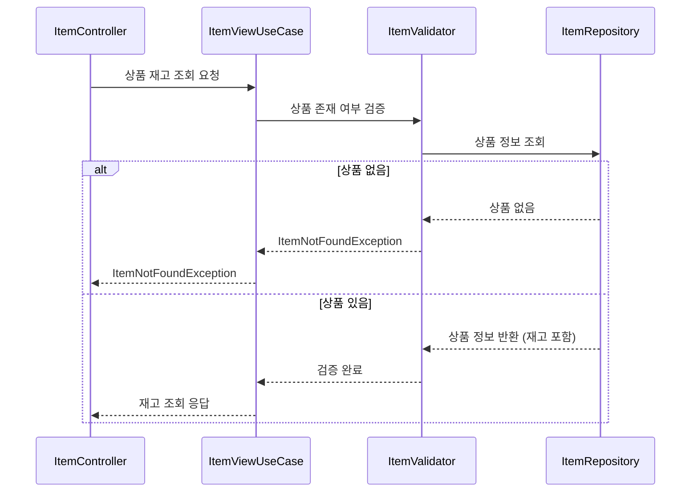
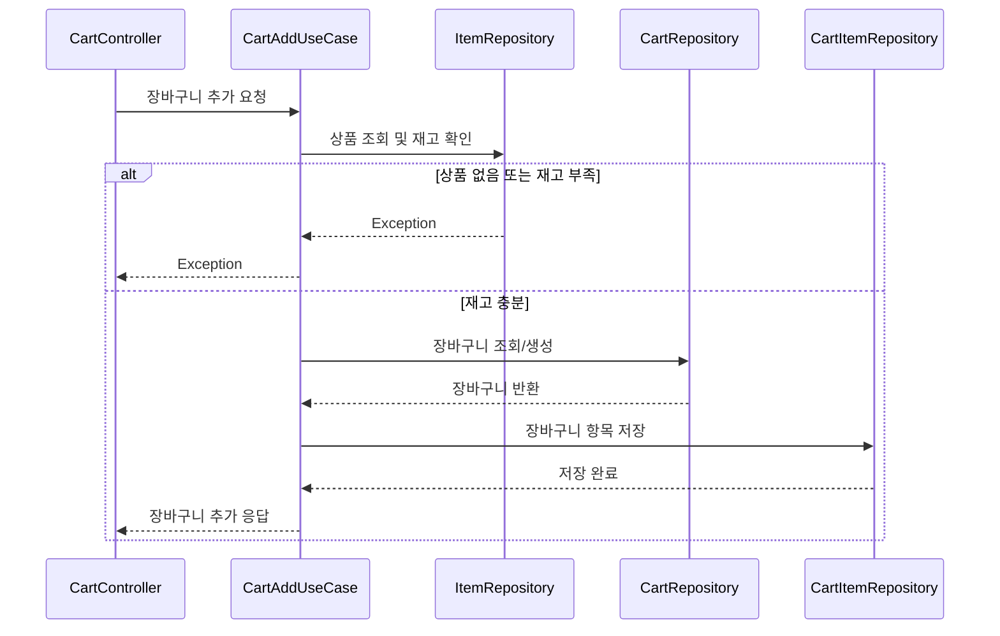
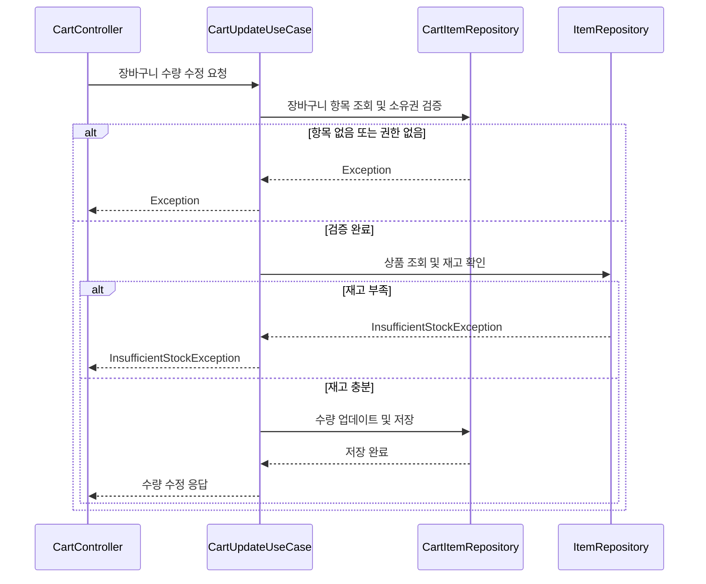
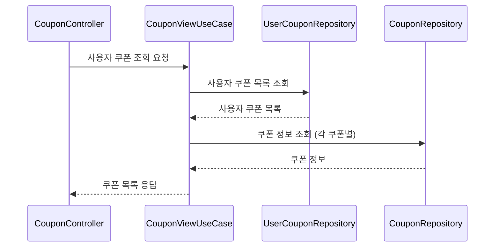
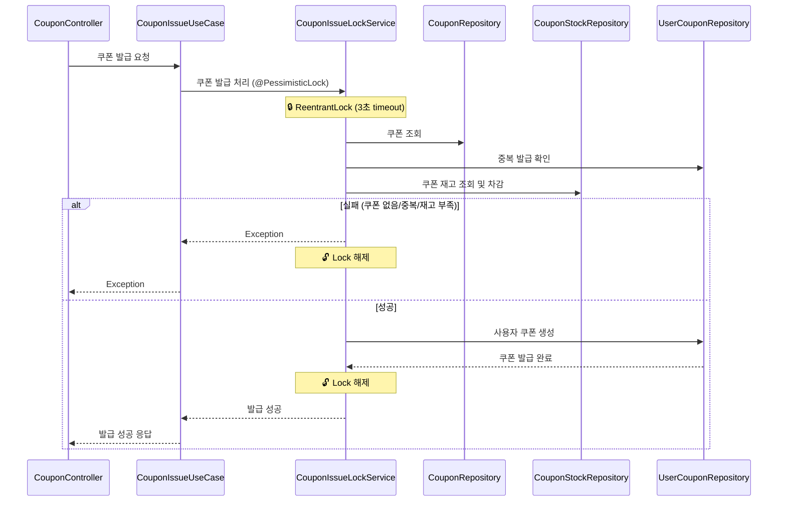
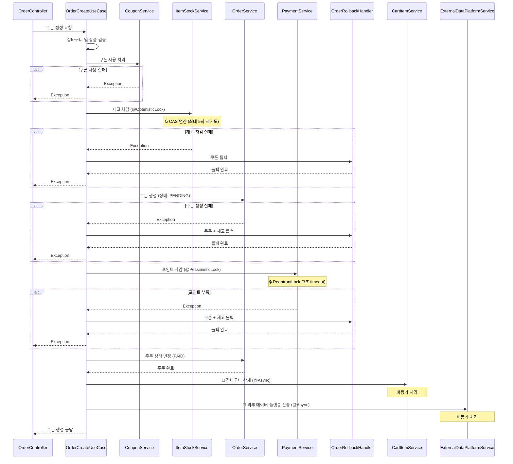

# E-Commerce 시스템


## 동시성 제어 설계

이커머스 백엔드 시스템에서 발생하는 동시성 이슈를 해결하기 위해 구현된 두 가지 In-Memory 잠금(Lock) 전략을 설명합니다.
모든 전략은 실제 DB를 사용하지 않는 것을 전제로 합니다.

* 비관적 락 (Pessimistic Lock): Map<Long, ReentrantLock>
* 낙관적 락 (Optimistic Lock): Map<Long, AtomicLong> (Version)


### 비관적 락 (Pessimistic Lock)

"충돌은 반드시 일어난다"고 가정합니다. 비즈니스 로직 실행 전에 락을 선점하여 다른 스레드의 접근을 **대기(Block)**시킵니다.

핵심 기술

Map<Long, ReentrantLock>을 사용하여 리소스 ID(resourceId)별로 락 객체를 관리합니다.

코드 구현 (PessimisticLockAspect.java)

```Java

/**
* 비관적 락(배타 락)을 처리하는 Aspect
* Map<Long, ReentrantLock>을 사용하여 리소스별 락 관리
  */
  @Aspect
  @Component
  @Slf4j
  public class PessimisticLockAspect {

  private final Map<Long, ReentrantLock> lockMap = new ConcurrentHashMap<>();

  @Around("@annotation(pessimisticLock) && args(resourceId, ..)")
  public Object handlePessimisticLock(ProceedingJoinPoint joinPoint, PessimisticLock pessimisticLock, long resourceId) throws Throwable {
  ReentrantLock lock = lockMap.computeIfAbsent(resourceId, key -> new ReentrantLock());
  boolean lockAcquired = false;

       try {
           log.debug("Attempting to acquire pessimistic lock for resource {} with timeout {} {}",
               resourceId, pessimisticLock.timeout(), pessimisticLock.timeUnit());

           lockAcquired = lock.tryLock(pessimisticLock.timeout(), pessimisticLock.timeUnit());

           if (!lockAcquired) {
               log.error("Failed to acquire pessimistic lock for resource {} within timeout", resourceId);
               throw new LockTimeoutException("락 획득에 실패했습니다. resourceId: " + resourceId);
           }

           log.debug("Pessimistic lock acquired for resource {}", resourceId);

           // 비즈니스 로직 실행
           return joinPoint.proceed();

       } catch (InterruptedException e) {
           Thread.currentThread().interrupt();
           log.error("Interrupted while acquiring lock for resource {}", resourceId);
           throw new LockInterruptedException(e);
       } finally {
           if (lockAcquired) {
               lock.unlock();
               log.debug("Pessimistic lock released for resource {}", resourceId);
           }
       }
  }
  }
```

적용 사례 및 선택 이유

* 적용 사례: 주문 시 포인트 차감, 선착순 쿠폰 발급
* 선택 이유:
    * 강력한 정합성: 포인트, 쿠폰 등은 데이터 정합성이 깨지면(e.g., 마이너스 포인트, 쿠폰 초과 발급) 비즈니스적으로 치명적입니다.
    * 명확한 실패 처리: 충돌 시 **재시도(Retry)**보다, 락 획득 실패 시 "쿠폰이 모두 소진되었습니다"와 같이 **안전한 실패(Fail-Fast)**로 즉시 처리하는 것이 로직상 더 적합합니다.


### 낙관적 락 (Optimistic Lock)

"충돌은 거의 일어나지 않는다"고 가정합니다. 락 없이(Non-Blocking) 로직을 우선 실행하고, 로직 실행 후에 버전(Version)을 검사하여 충돌 여부를 판단합니다.

핵심 기술

Map<Long, AtomicLong>을 사용하여 resourceId별로 **버전(Version)**을 관리하고, CAS(Compare-and-Set) 연산을 통해 충돌을 감지합니다.

코드 구현 (OptimisticLockAspect.java)

```Java

/**
* 낙관적 락을 처리하는 Aspect
* Map<Long, AtomicLong>을 사용하여 버전 관리
  */
  @Aspect
  @Component
  @Slf4j
  public class OptimisticLockAspect {

  private final Map<Long, AtomicLong> versionMap = new ConcurrentHashMap<>();

  @Around("@annotation(optimisticLock) && args(resourceId, ..)")
  public Object handleOptimisticLock(ProceedingJoinPoint joinPoint, OptimisticLock optimisticLock, long resourceId) throws Throwable {
  int maxRetries = optimisticLock.maxRetries();
  long retryDelay = optimisticLock.retryDelay();

       for (int attempt = 0; attempt < maxRetries; attempt++) {
           try {
               // 현재 버전 가져오기
               AtomicLong version = versionMap.computeIfAbsent(resourceId, key -> new AtomicLong(0));
               long currentVersion = version.get();

               log.debug("Optimistic lock attempt {}/{} for resource {} with version {}",
                   attempt + 1, maxRetries, resourceId, currentVersion);

               // 비즈니스 로직 실행
               Object result = joinPoint.proceed();

               // 버전 증가 (CAS 연산)
               if (version.compareAndSet(currentVersion, currentVersion + 1)) {
                   log.debug("Optimistic lock succeeded for resource {} (version {} -> {})",
                       resourceId, currentVersion, currentVersion + 1);
                   return result;
               } else {
                   // 버전이 변경되었으면 충돌 발생
                   log.debug("Optimistic lock conflict detected for resource {} at attempt {}",
                       resourceId, attempt + 1);

                   if (attempt < maxRetries - 1) {
                       // 재시도 전 대기
                       optimisticLock.timeUnit().sleep(retryDelay);
                   }
               }
           } catch (Exception e) {
               log.error("Error during optimistic lock execution for resource {}: {}",
                   resourceId, e.getMessage());
               throw e;
           }
       }

       // 최대 재시도 횟수 초과
       log.error("Optimistic lock failed after {} attempts for resource {}", maxRetries, resourceId);
       throw new OptimisticLockException("최대 재시도 횟수를 초과했습니다. resourceId: " + resourceId);
  }

}
```

적용 사례 및 선택 이유

* 적용 사례: 재고 차감
* 선택 이유:
    * 높은 처리량: 재고는 동시 접근이 가장 빈번한 리소스입니다. 비관적 락은 시스템 전체 성능 저하를 유발할 수 있습니다.
    * Non-Blocking: 락을 잡고 스레드를 대기시키지 않아, 경합이 발생하더라도 시스템 처리량을 극대화할 수 있습니다.
    * 재시도 가능: 충돌이 감지되더라도, 재고 차감 로직은 재시도하는 비용이 락을 대기하는 비용보다 저렴하다고 판단했습니다.


## ERD (Entity Relationship Diagram)


---

## API 시퀀스 다이어그램

### 1.1 상품 목록 조회 (GET /api/items) - Cursor 기반 페이징



### 1.2 상품 상세 조회 (GET /api/items/{itemId})


### 1.3 인기 상품 조회 (GET /api/items/popular)



인기도 계산식: `조회수 × 9 + 판매량 × 1` 가중치 적용

### 1.4 상품 재고 확인 (GET /api/items/{itemId}/stock)



Item 엔티티에 재고 정보가 포함되어 있어 실시간 재고 확인 가능.

### 2.1 장바구니 상품 추가 (POST /api/cart/items)



### 2.3 장바구니 수량 수정 (PATCH/api/cart/items/{cartItemId})




### 3.1 사용자 쿠폰 조회 (GET /api/users/{userId}/coupons)



### 3.2 쿠폰 발급 (POST /api/coupons/{couponId}/issue)



### 4.1 주문 생성 (POST /api/orders)



**동시성 제어:**
- 재고 차감: Optimistic Lock (ConcurrentHashMap + AtomicLong)
- 포인트 차감: Pessimistic Lock (ReentrantLock)
- 실패 시 OrderRollbackHandler를 통한 수동 롤백
