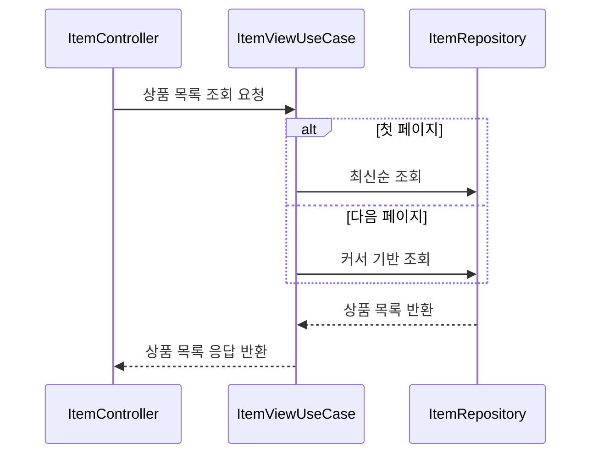
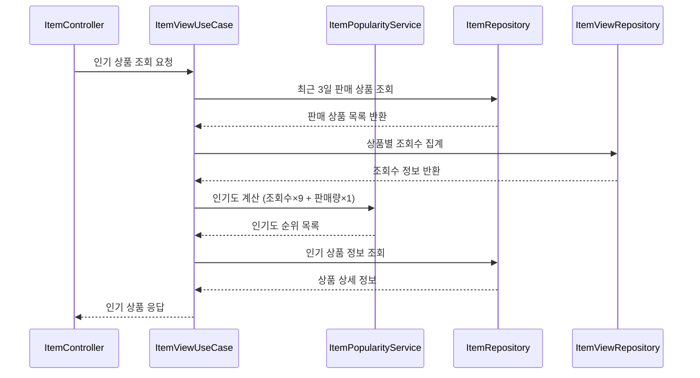
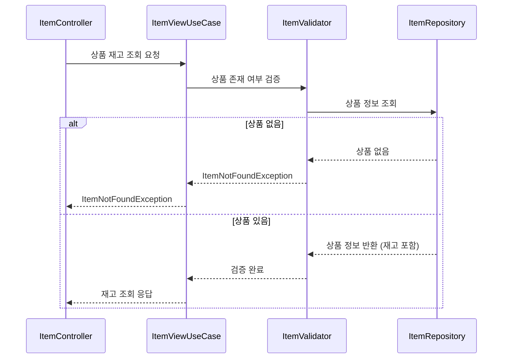
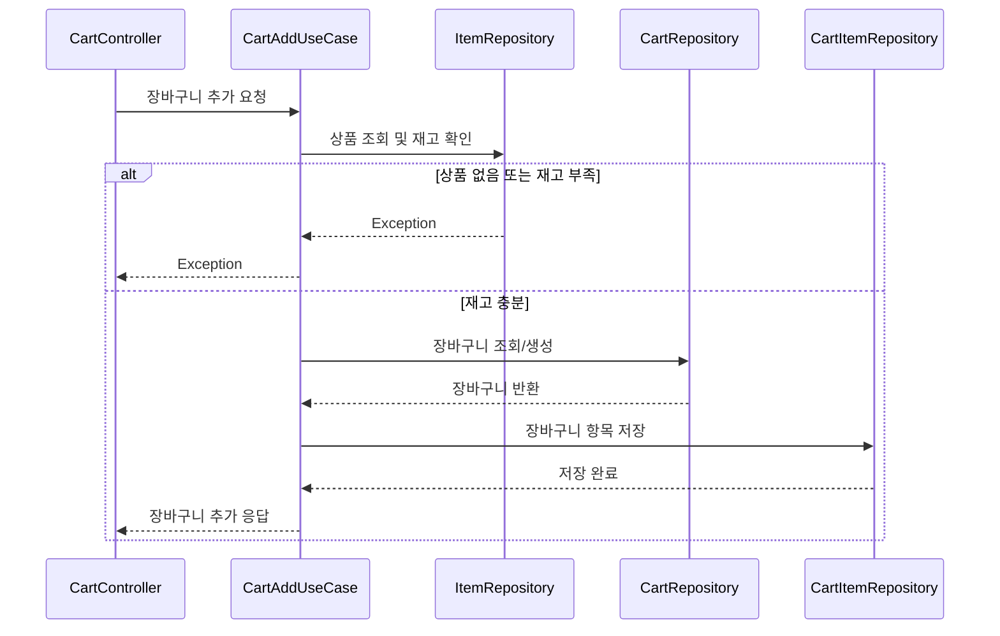
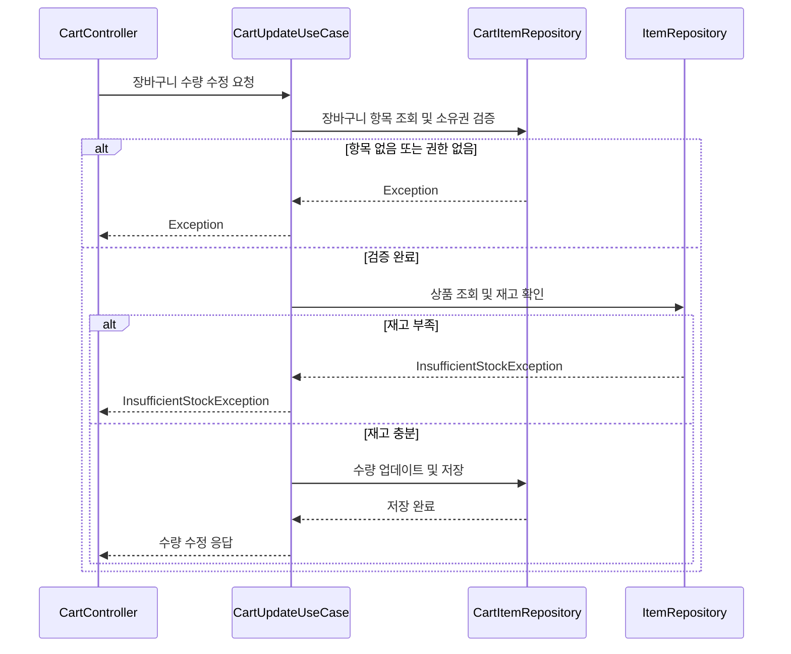
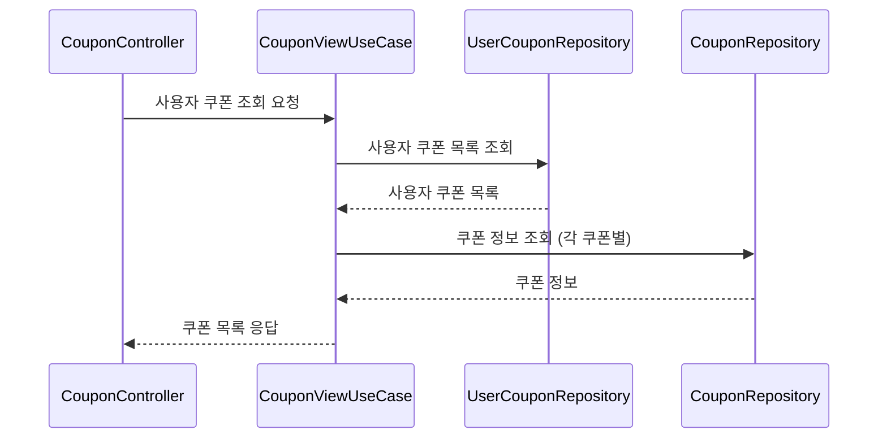
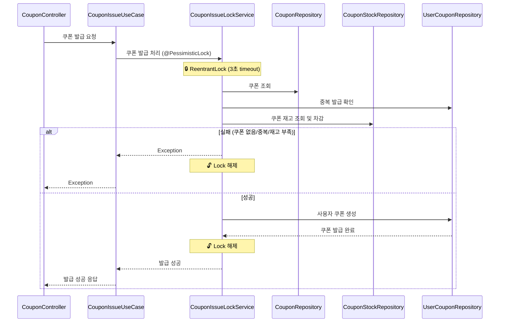
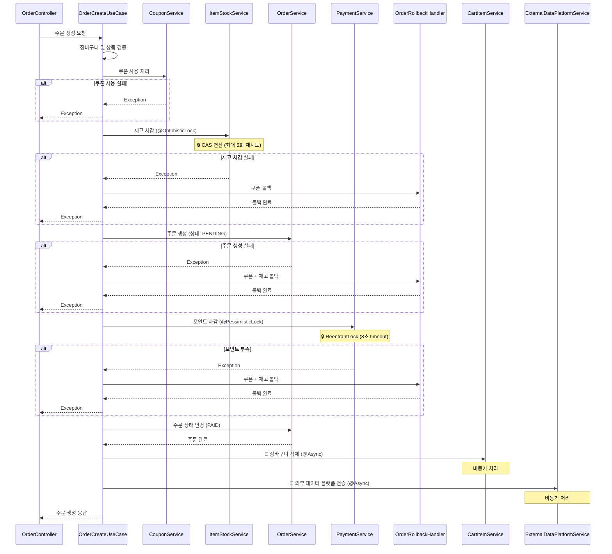

# E-Commerce 시스템

## ERD (Entity Relationship Diagram)

---

## API 시퀀스 다이어그램

### 1.1 상품 목록 조회 (GET /api/items) - Cursor 기반 페이징

### 1.2 상품 상세 조회 (GET /api/items/{itemId})

### 1.3 인기 상품 조회 (GET /api/items/popular)

인기도 계산식: `조회수 × 9 + 판매량 × 1` 가중치 적용

### 1.4 상품 재고 확인 (GET /api/items/{itemId}/stock)

Item 엔티티에 재고 정보가 포함되어 있어 실시간 재고 확인 가능.

### 2.1 장바구니 상품 추가 (POST /api/cart/items)

### 2.3 장바구니 수량 수정 (PATCH/api/cart/items/{cartItemId})

### 3.1 사용자 쿠폰 조회 (GET /api/users/{userId}/coupons)

### 3.2 쿠폰 발급 (POST /api/coupons/{couponId}/issue)

### 4.1 주문 생성 (POST /api/orders)

**동시성 제어:**
- 재고 차감: Optimistic Lock (ConcurrentHashMap + AtomicLong)
- 포인트 차감: Pessimistic Lock (ReentrantLock)
- 실패 시 OrderRollbackHandler를 통한 수동 롤백
