# 주문 생성 프로세스 - 이벤트 기반 아키텍처 설계

## Architecture Overview
- **Pattern**: Saga Orchestration (Event-Driven)
- **Concurrency Control**:
  - **Stock/Point**: Redisson Distributed Lock
  - **Coupon**: JPA Optimistic Lock (@Version)
  - **Event Tracking**: Redis Hash (이벤트 수신 여부 추적)
- **Payment Processing**: Synchronous
- **Stock & Coupon Processing**: Asynchronous (Parallel)

## 시퀀스 다이어그램

```mermaid
sequenceDiagram
    participant Client as 클라이언트
    participant API as OrderController
    participant UC as OrderCreateUseCase
    participant OCFM as OrderCreateFlowManager<br/>(Orchestrator)
    participant Val as CartItemValidator<br/>ItemValidator
    participant OS as OrderService
    participant ISS as ItemStockService
    participant CS as CouponService
    participant UPS as UserPointService
    participant EDPC as SendOrderDataEventKafkaConsumer
    participant EDP as ExternalDataPlatformService

    Note over Client,EDP: 1. 주문 생성 및 이벤트 발행 (Scatter)

    Client->>API: POST /orders
    API->>UC: create(userId, cartItemIds, userCouponId)

    UC->>Val: 장바구니 및 상품 유효성 검증
    Val-->>UC: 검증 완료

    UC->>OS: createOrder(PENDING 상태)
    OS-->>UC: Order 생성 완료<br/>(status=PENDING)

    UC->>UC: Redis에 이벤트 추적 상태 초기화<br/>(stockReserved=false, couponUsed=false/true)

    UC->>UC: publish(OrderCreatedEvent)
    Note over UC: 이벤트 비동기 발행<br/>UseCase 역할 종료

    UC-->>API: 202 Accepted (orderId, PENDING)
    API-->>Client: 주문 접수 완료 응답

    Note over Client,EDP: 2. 도메인 서비스 병렬 처리 (Processing)

    par 재고 처리 (Async)
        UC-->>ISS: @EventListener(OrderCreatedEvent)
        ISS->>ISS: decreaseStockForItem(itemId, quantity)
        Note over ISS: Redisson 분산락으로<br/>동시성 제어
        alt 재고 차감 성공
            ISS->>ISS: publish(StockReservedEvent)
        else 재고 차감 실패
            ISS->>ISS: publish(StockFailedEvent)
        end
    and 쿠폰 처리 (Async)
        UC-->>CS: @EventListener(OrderCreatedEvent)
        CS->>CS: useCoupon(userCouponId)
        Note over CS: JPA 낙관적 락으로<br/>동시성 제어
        alt 쿠폰 사용 성공
            CS->>CS: publish(CouponUsedEvent)
        else 쿠폰 사용 실패
            CS->>CS: publish(CouponFailedEvent)
        end
    end

    Note over Client,EDP: 3. FlowManager가 결과 수신 및 집계 (Gather & Aggregation)

    ISS-->>OCFM: @EventListener(StockReservedEvent)
    activate OCFM
    OCFM->>OCFM: Redis HSET<br/>order:event:tracker:{orderId}<br/>stockReserved = true
    OCFM->>OCFM: Redis HGETALL로<br/>isReadyForPayment() 체크
    Note over OCFM: stockReserved=true && <br/>couponUsed=true/null?
    OCFM-->>OCFM: false (쿠폰 처리 대기 중)
    deactivate OCFM

    CS-->>OCFM: @EventListener(CouponUsedEvent)
    activate OCFM
    OCFM->>OCFM: Redis HSET<br/>order:event:tracker:{orderId}<br/>couponUsed = true
    OCFM->>OCFM: Redis HGETALL로<br/>isReadyForPayment() 체크
    Note over OCFM: stockReserved=true && <br/>couponUsed=true?
    OCFM-->>OCFM: true (결제 준비 완료)
    OCFM->>OS: findById(orderId)<br/>결제 정보 조회
    OS-->>OCFM: Order 정보
    OCFM->>OCFM: publish(ProcessPaymentEvent)
    Note over OCFM: 결제 진행
    deactivate OCFM

    Note over Client,EDP: 4. FlowManager가 결제 이벤트 수신 및 처리

    OCFM-->>OCFM: @EventListener(ProcessPaymentEvent)
    OCFM->>UPS: use(userId, finalAmount)
    Note over UPS: Redisson 분산락<br/>동기 Blocking 처리

    alt 결제 성공
        UPS-->>OCFM: 결제 완료
        OCFM->>OS: completeOrderPayment(orderId)
        Note over OS: status = PAID
        OCFM->>OCFM: publish(OrderCompletedEvent)
        Note over OCFM: 후처리 트리거
    else 결제 실패
        UPS-->>OCFM: Exception
        OCFM->>OS: failOrder(orderId)
        Note over OS: status = FAILED,<br/>failReason = PAYMENT_FAILED
        OCFM->>OCFM: publish(CompensateStockCommand)
        OCFM->>OCFM: publish(CompensateCouponCommand)
    end

    Note over Client,EDP: 5. FlowManager가 실패 이벤트 수신 및 보상 조율

    alt Case A: 재고 실패
        ISS-->>OCFM: @EventListener(StockFailedEvent)
        OCFM->>OS: failOrder(orderId)
        Note over OS: status = FAILED,<br/>failReason = STOCK_UNAVAILABLE
        OCFM->>OCFM: if (isCouponUsed)?
        OCFM->>OCFM: publish(CompensateCouponCommand)
        OCFM-->>CS: @EventListener(CompensateCouponCommand)
        CS->>CS: restoreCoupon(userCouponId)
    else Case B: 쿠폰 실패
        CS-->>OCFM: @EventListener(CouponFailedEvent)
        OCFM->>OS: failOrder(orderId)
        Note over OS: status = FAILED,<br/>failReason = COUPON_UNAVAILABLE
        OCFM->>OCFM: if (isStockReserved)?
        OCFM->>OCFM: publish(CompensateStockCommand)
        OCFM-->>ISS: @EventListener(CompensateStockCommand)
        ISS->>ISS: increaseStockForItem(itemId, quantity)
    else Case C: 결제 실패 (위 4번에서 처리)
        OCFM-->>ISS: CompensateStockCommand
        OCFM-->>CS: CompensateCouponCommand
        ISS->>ISS: increaseStockForItem()
        CS->>CS: restoreCoupon()
    end

    Note over Client,EDP: 6. FlowManager가 주문 완료 후처리

    OCFM-->>OCFM: @EventListener(OrderCompletedEvent)
    OCFM->>OCFM: 인기 상품 점수 증가 처리
    OCFM->>OCFM: publish(SendOrderDataEvent)
    Note over OCFM: 외부 데이터 전송 이벤트 발행
    OCFM->>OCFM: Redis 이벤트 추적 데이터 삭제

    OCFM-->>EDPC: @KafkaListener(SendOrderDataEvent)
    EDPC->>EDP: sendOrderDataAsync(orderId)
    Note over EDP: 외부 데이터 플랫폼<br/>비동기 전송
```



## 주요 컴포넌트 설명

### 1. OrderCreateUseCase
주문 생성 진입점 - 검증 및 초기 주문 생성만 담당

#### 역할
- **장바구니 및 상품 검증**: CartItemValidator, ItemValidator를 통한 유효성 검사
- **쿠폰 정보 조회**: 쿠폰 할인 금액 계산 (실제 사용은 이벤트에서 처리)
- **주문 생성**: OrderService를 통해 PENDING 상태의 주문 생성
- **이벤트 발행**: OrderCreatedEvent 발행 후 역할 종료
- **응답 반환**: 202 Accepted (orderId, PENDING) 응답

#### 특징
- **단일 책임**: 주문 생성과 초기 이벤트 발행만 담당
- **빠른 응답**: 이벤트 발행 후 즉시 응답을 반환하여 사용자 경험 향상
- **트랜잭션 범위**: 주문 생성까지만 트랜잭션 처리

### 2. OrderCreateFlowManager (Central Orchestrator)
중앙 오케스트레이터 - 주문 생성 이후의 모든 이벤트 기반 플로우를 관리

#### 역할
- **이벤트 수신 및 조율**:
  - `@EventListener(StockReservedEvent.class)` - 재고 성공 수신
  - `@EventListener(CouponUsedEvent.class)` - 쿠폰 성공 수신
  - `@EventListener(StockFailedEvent.class)` - 재고 실패 수신
  - `@EventListener(CouponFailedEvent.class)` - 쿠폰 실패 수신
  - `@EventListener(ProcessPaymentEvent.class)` - 결제 프로세스 수신
  - `@EventListener(OrderCompletedEvent.class)` - 주문 완료 후처리
- **집계 로직**: OrderEventTracker(Redis)를 통해 이벤트 수신 여부 추적
- **결제 조율**: 결제 준비 완료 시 ProcessPaymentEvent 발행 → UserPointService 호출
- **보상 조율**: 실패 시 CompensateStockCommand, CompensateCouponCommand 발행
- **후처리**: 주문 완료 시 외부 데이터 플랫폼 전송 및 인기 상품 점수 업데이트

#### 핵심 흐름
```
OrderCreatedEvent 수신 대기
  ↓
StockReservedEvent + CouponUsedEvent 수신 → 집계
  ↓
ProcessPaymentEvent 발행 → 결제 처리
  ↓
성공: OrderCompletedEvent 발행 → 후처리
실패: CompensateXXXCommand 발행 → 보상 처리
```

#### 특징
- **비동기 이벤트 리스너**: 모든 이벤트를 `@Async`로 비동기 처리 (결제 제외)
- **상태 기반 처리**: 이벤트 도착 순서에 무관하게 상태 기반으로 처리
- **느슨한 결합**: 각 도메인 서비스와 독립적으로 동작

### 3. ItemStockService
도메인 서비스 - 재고 처리만 담당

- **이벤트 구독**: `@EventListener(OrderCreatedEvent.class)`
- **재고 처리**: decreaseStockForItem() 실행
- **동시성 제어**: Redisson 분산락
- **이벤트 발행**: 성공 시 StockReservedEvent, 실패 시 StockFailedEvent
- **보상 처리**: `@EventListener(CompensateStockCommand.class)` - increaseStockForItem() 실행

### 4. CouponService
도메인 서비스 - 쿠폰 처리만 담당

- **이벤트 구독**: `@EventListener(OrderCreatedEvent.class)`
- **쿠폰 처리**: useCoupon() 실행
- **동시성 제어**: JPA 낙관적 락 (@Version)
- **이벤트 발행**: 성공 시 CouponUsedEvent, 실패 시 CouponFailedEvent
- **보상 처리**: `@EventListener(CompensateCouponCommand.class)` - restoreCoupon() 실행

### 5. OrderEventTracker (Redis)
이벤트 추적 서비스 - Redis 기반 이벤트 수신 여부 관리

- **초기화**: initialize(orderId, hasCoupon) - 주문 생성 시 Redis Hash 초기화
- **재고 예약 표시**: markStockReserved(orderId) - stockReserved = true 설정
- **쿠폰 사용 표시**: markCouponUsed(orderId) - couponUsed = true 설정
- **결제 준비 여부**: isReadyForPayment(orderId) - 두 이벤트 완료 여부 확인
- **Redis 키**: `order:event:tracker:{orderId}` (Hash 타입)
- **TTL**: 24시간 자동 삭제
- **역할**: DB와 분리된 이벤트 추적 레이어, 빠른 읽기/쓰기 성능

### 6. OrderService
상태 관리 서비스 - FlowManager에서 호출

- **주문 생성**: createOrder() - PENDING 상태로 생성 (OrderCreateUseCase에서 호출)
- **상태 변경**: completeOrderPayment(), failOrder()
- **주문 조회**: findById(orderId) - 결제 정보 조회용
- **역할**: 비즈니스 데이터 영속성 관리 (이벤트 추적은 Redis로 분리)

### 7. UserPointService
결제 서비스 - FlowManager에서 직접 호출

- **포인트 차감**: use(userId, finalAmount)
- **동시성 제어**: Redisson 분산락
- **동기 처리**: Blocking 방식

### 8. SendOrderDataEventKafkaConsumer
외부 데이터 플랫폼 전송 Consumer - 주문 완료 후 외부 시스템 연동

- **이벤트 구독**: `@KafkaListener(SendOrderDataEvent.class)`
- **Kafka Topic**: `send-order-data`
- **Consumer Group**: `external-data-service-group`
- **처리 내용**: externalDataPlatformService.sendOrderDataAsync(orderId) 호출
- **역할**: 주문 완료 후 외부 데이터 플랫폼으로 주문 데이터 비동기 전송
- **실패 처리**: 재시도 로직 또는 Dead Letter Queue 처리 필요 (TODO)

## 이벤트 목록

### 주요 이벤트
- `OrderCreatedEvent`: 주문 생성 완료 (Scatter 시작)
- `StockReservedEvent`: 재고 차감 성공
- `StockFailedEvent`: 재고 차감 실패
- `CouponUsedEvent`: 쿠폰 사용 성공
- `CouponFailedEvent`: 쿠폰 사용 실패
- `OrderCompletedEvent`: 주문 완료 (결제 성공)
- `SendOrderDataEvent`: 외부 데이터 플랫폼 전송 요청

### 보상 트랜잭션 커맨드
- `CompensateStockCommand`: 재고 복구 명령
- `CompensateCouponCommand`: 쿠폰 복구 명령

## 동시성 제어 전략

### 1. 재고 차감 (ItemStockService)
```java
@DistributedLock(keyResolver = "itemStockLockKeyResolver", key = "#itemId")
public void decreaseStockForItem(Long itemId, int quantity)
```
- Redisson 분산락으로 동일 itemId에 대한 동시 접근 제어

### 2. 쿠폰 사용 (CouponService)
- JPA 낙관적 락 (@Version) 활용
- 동시 사용 시도 시 OptimisticLockException 발생

### 3. 결과 집계 (OrderCreateFlowManager → OrderEventTracker)
**처리 순서**:
1. FlowManager가 StockReservedEvent 또는 CouponUsedEvent 수신
2. OrderEventTracker의 markStockReserved() 또는 markCouponUsed() 호출
3. Redis Hash 업데이트 (`HSET order:event:tracker:{orderId} stockReserved/couponUsed true`)
4. 결제 준비 조건 검사 (`isReadyForPayment()`)
5. 조건 만족 시 FlowManager에서 ProcessPaymentEvent 발행

**동시성 제어**:
- Redis의 빠른 읽기/쓰기 성능 활용
- 이벤트 도착 순서에 무관하게 상태 기반 처리
- DB 락 없이 이벤트 추적 가능

**결제 준비 조건**:
- **쿠폰 사용**: `stockReserved = "true"` && `couponUsed = "true"` (Redis Hash)
- **쿠폰 미사용**: `stockReserved = "true"` && `couponUsed = "true"` (초기화 시 true로 설정)
- Redis에서 초기화 시 쿠폰이 없으면 `couponUsed = "true"`로 설정

**Redis 키 구조**:
```
order:event:tracker:{orderId} (Hash)
├─ stockReserved: "false" → "true"
└─ couponUsed: "false" → "true" (쿠폰 없으면 초기값 "true")
```

### 4. 포인트 결제 (UserPointService)

- Redisson 분산락으로 동일 userId에 대한 동시 접근 제어
- 동시에 여러 주문이 같은 사용자의 포인트를 차감하려 할 때 순차적으로 처리
- 동기 처리 방식으로 결제 성공/실패를 즉시 반환

## 주문 상태 흐름

```
PENDING → PAID (성공)
       ↓
     FAILED (재고 실패 / 쿠폰 실패 / 결제 실패)
```

### 실패 사유 (failReason)
- `STOCK_UNAVAILABLE`: 재고 부족
- `COUPON_UNAVAILABLE`: 쿠폰 사용 불가
- `PAYMENT_FAILED`: 결제 실패

## 처리 시나리오

### Scenario 1: 정상 처리
```
시간 0s: 주문 생성 (PENDING) + Redis 초기화 (stockReserved=false, couponUsed=false)
시간 1s: StockReservedEvent 도착 → Redis stockReserved = "true"
시간 2s: CouponUsedEvent 도착 → Redis couponUsed = "true"
        → isReadyForPayment() = true → 결제 진입 → PAID
```

### Scenario 2: 재고 실패
```
시간 0s: 주문 생성 (PENDING)
시간 1s: StockFailedEvent 도착
        → FAILED 처리
        → 쿠폰 성공한 경우 CompensateCouponCommand 발행
```

### Scenario 3: 쿠폰 실패
```
시간 0s: 주문 생성 (PENDING)
시간 1s: CouponFailedEvent 도착
        → FAILED 처리
        → 재고 성공한 경우 CompensateStockCommand 발행
```

### Scenario 4: 결제 실패
```
시간 0s: 주문 생성 (PENDING)
시간 1s: 재고/쿠폰 성공
시간 2s: 결제 실패 (Exception)
        → FAILED 처리
        → CompensateStockCommand + CompensateCouponCommand 발행
```

## 장점

1. **비동기 병렬 처리**: 재고/쿠폰 처리가 동시에 진행되어 성능 향상
2. **느슨한 결합**: 각 도메인 서비스가 독립적으로 동작
3. **확장성**: 새로운 처리 단계 추가 용이
4. **관심사 분리**: DB는 비즈니스 데이터, Redis는 이벤트 추적으로 역할 분리
5. **성능 최적화**: Redis의 빠른 읽기/쓰기로 DB 락 경합 없이 이벤트 집계
6. **복원력**: 보상 트랜잭션으로 실패 시 자동 롤백
7. **부분 실패 감지**: 한쪽만 성공한 케이스도 정확히 보상
8. **자동 정리**: Redis TTL로 임시 이벤트 추적 데이터 자동 삭제

## 주의사항

1. **멱등성**: 이벤트 리스너는 멱등하게 설계되어야 함
2. **이벤트 재시도**: 이벤트 발행/처리 실패 시 재시도 로직 필요 (Spring Retry)
3. **보상 실패**: 보상 트랜잭션도 실패할 수 있으므로 Dead Letter Queue 및 모니터링 필수
4. **이벤트 순서**: 이벤트 도착 순서는 보장되지 않으므로 상태 기반으로 처리
